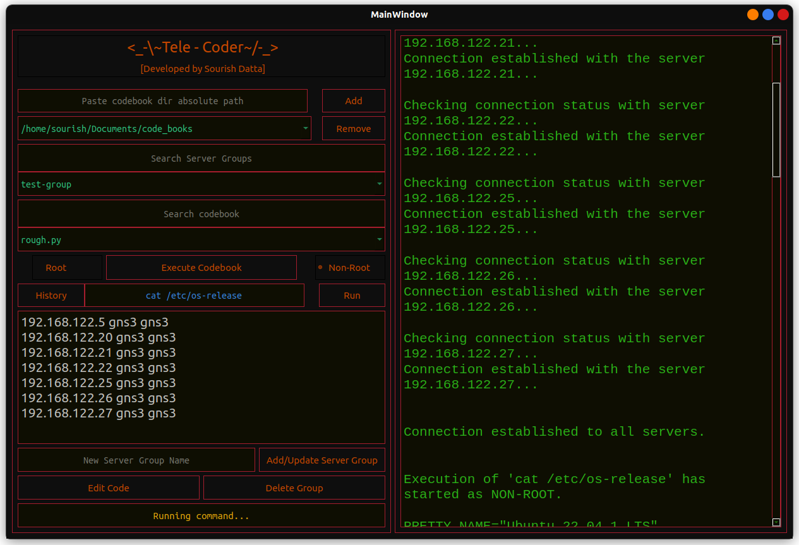

# Tele-Coder

Tele-Coder is an alternative to ansible based on ssh. This one is very simple as it doesn't require much knowledge to act on. Just run the python code and use the gui (developed in pyqt5) to acess your bulk servers. 
Just give it a try! 


## Author

- [@Sourish_Datta](https://www.github.com/xorish)


## Pre-requisite

Install PyQt5 using pip

```bash
pip install PyQt5
```
    
## Deployment

To deploy this project run

```bash
  python3 main.py
```
As simple as that!:-)

## Screenshot



## Usage/Examples

Step1: 

Add a code-book directory first (You can add multiple directories though and switch between those using the combobox as well as remove those directory as well). 
For adding and directory just paste the directory absolute path and click add.

Step2: 

Create  a new server group. For that just add the server ip user and password in each new line, 
single space separated (eg: server-ip username password) as shown in the screenshot. Then give your group a name and click add/update button.
Now select the group from the combo list. You can add multiple groups.
To update an existing group just select the group and make the necessery changes and click Add/update button. 

Note : While updating a group leave the group name filed blank otherwise it'll create a new group, which is useful is you need to create a group from an existing group.

Step 3:

Now create your python and bash scripts in the code book directory and those will automatically loaded. Now select one and hit 'Execute Codebook'. You can execute a code in two modes, one is root and another is non-root. As per your use-case select one.

It also supports running ad-hoc commands. Just add your single line command and hit enter. That command will run against the select server group.

The history will show the previously run ad-commands, so that you can simply copy from old ones and run again easily.

This one is an early release. More features will be added. Feel free you contribute.
## Contributing

Pull requests are welcome. For major changes, please open an issue first to discuss what you would like to change.

Please make sure to update tests as appropriate.

## License

[GNU GPLv3](https://www.gnu.org/licenses/gpl-3.0.en.html)
